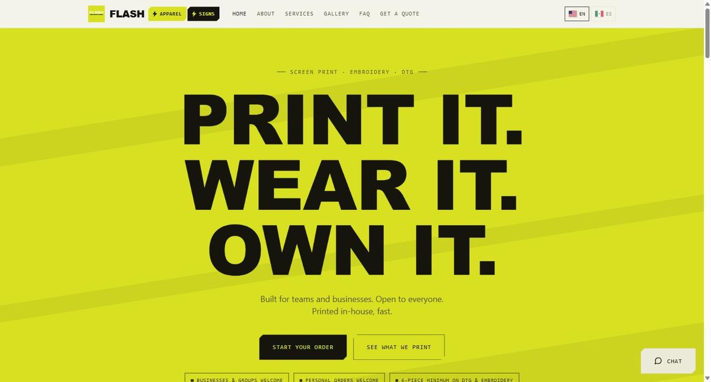
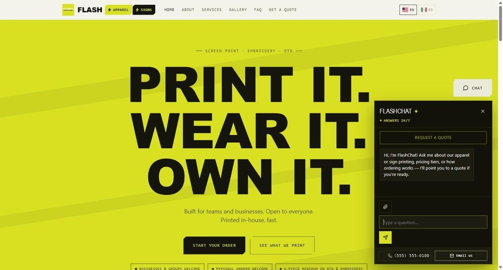
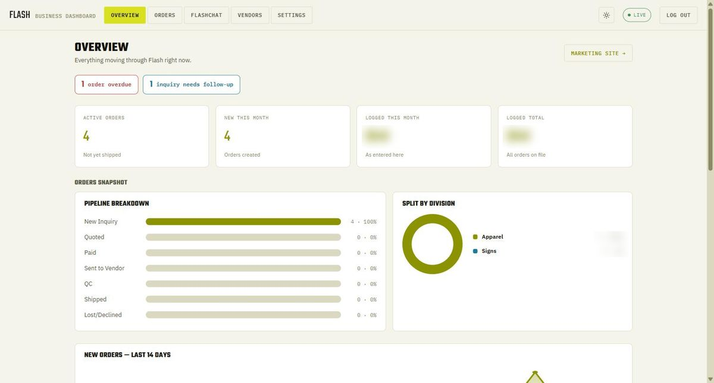

# Flash Custom Print — AI chat, quoting & operations dashboard

A bilingual AI chat assistant, quote capture, and a private operations dashboard for a Houston custom-apparel and sign shop — so every inquiry gets an answer, every quote gets logged, and the whole order pipeline is visible in one place.

Live: https://flashcustomprint.com · Built by Gilbert Renteria

## Screenshots







## Why I built it

I ran this shop's quoting by hand. Inquiries came in through Instagram DMs, texts, and email at all hours, and if I was busy with a job they waited — or I missed them entirely. Customers write in both English and Spanish, and I had no clean record of what I'd quoted, what had been paid, or what was sitting at a vendor. I built this so inquiries get answered in English or Spanish 24/7, every quote request is captured whether it comes from the site form or a chat, and I can see the whole pipeline from new inquiry to shipped without digging through message threads.

## What it does

- **Bilingual AI chat (Claude API).** "FlashChat" answers product, process, and pricing-tier questions in English or Spanish, checks whether the answer actually helped, and — once it has a name, a way to reach the visitor, and what they need — submits a quote request on the visitor's behalf. Visitors can attach a logo or design file mid-chat and it rides along with the quote.
- **Human takeover mid-conversation.** Every chat is saved with its full transcript. From the dashboard I can open any live conversation and reply; the moment I do, the AI stops answering that visitor. "Hand back to AI" returns it, and a conversation I go quiet on is handed back automatically so nobody is left waiting.
- **Quote capture from two sources.** The on-site quote form and the chat both write the same records: a quote plus a matching card on the order board, tagged by source (`web`, `chat`, or `manual`).
- **Private ops dashboard.** Order pipeline (New Inquiry → Quoted → Paid → Sent to Vendor → QC → Shipped, plus Lost/Declined with a captured reason), win/loss rate, overdue and needs-follow-up alerts, per-order vendor cost for real margin, a vendor list, a 14-day traffic and conversion view with top referral sources, live "who's on the site right now," and one-tap quick replies for chat.
- **Notifications.** Email (Resend) and SMS (Twilio) alerts to the shop for new quotes, new chats, and chats the AI couldn't resolve; customers get a bilingual confirmation that their request went through. Every notification is best-effort — it can never block or fail the request that triggered it.

## How it's built

**Stack:** Cloudflare Pages (static site) + Pages Functions (serverless API) · Cloudflare D1 (SQLite, 12-table schema) · Anthropic Claude API · Resend (email) · Twilio (SMS) · vanilla HTML/CSS/JS, no build step.

**AI-assisted development:** I designed the workflows and data model and built it with Claude as a coding partner; every feature started as a process I ran by hand.

### Repo map

| Path | What it does |
| --- | --- |
| `public/index.html` | Marketing site (EN/ES), quote form, shop/product customizer, embedded chat widget, visitor presence ping |
| `public/chat/index.html` | Standalone full-page chat |
| `public/dashboard/index.html` | Private dashboard — Overview, Orders, FlashChat, Vendors, Settings tabs |
| `public/img/` | Portfolio photos used by the site |
| `schema.sql` | D1 schema: quotes, orders, vendors, roadmap items, business info, visitors, visit log, chat sessions/messages, alert throttle, quick replies, chat attachments |
| `functions/api/_middleware.js` | Gate: every `/api/*` route requires the dashboard login cookie except the public ones (quotes, chat, presence, login/logout/session) |
| `functions/_lib/auth.js` | Single shared password (`ADMIN_KEY`) → signed, HMAC-SHA256 httpOnly cookie; no user table needed |
| `functions/_lib/notify.js` | Best-effort Resend email + Twilio SMS helpers (shop alerts and bilingual customer confirmations) |
| `functions/api/chat/index.js` | Chat endpoint: saves the visitor message, alerts the shop on a new conversation, calls Claude with the last 12 turns, parses the hidden quote/status tags, submits the quote and order |
| `functions/api/chat/[sessionId].js` | Visitor's browser polls this to pick up human replies |
| `functions/api/quotes.js` | Quote form → `quotes` row + `orders` card in "New Inquiry", notifications, honeypot spam check |
| `functions/api/shop-order.js` | Product-customizer order request → email/SMS only (no DB write) |
| `functions/api/presence.js` | 20-second heartbeat from the site; filters bots, logs first visits with referral source, powers the Live tab |
| `functions/api/login.js` / `logout.js` / `session.js` | Dashboard sign-in, sign-out, and "am I logged in?" |
| `functions/api/orders/` | List/create/update/delete order cards (stage, amount, quoted-for, lost reason, vendor cost) |
| `functions/api/vendors/` | Vendor list CRUD |
| `functions/api/quick-replies/` | Canned chat replies, ordered |
| `functions/api/roadmap/` | Ideas/roadmap list for the business |
| `functions/api/info.js` | Single-row business reference card shown in Settings |
| `functions/api/metrics/summary.js` | 14-day daily visits, 30-day visits/quotes/conversion, top sources |
| `functions/api/live/visitors.js` | Who is on the site right now (active in the last 60s) |
| `functions/api/live/sessions/` | Recent chats with search; per-session thread, reply (takes over from AI), release (hands back), delete |
| `wrangler.toml` | Cloudflare Pages + D1 binding |

## Design decisions

- **The rules live in code, not in the model.** The AI only writes conversational text; whether a quote is actually created, whether a second quote is blocked, when a stale human takeover reverts to AI (6 minutes), and how often a visitor can trigger an alert (30 minutes) are all enforced in `functions/api/chat/index.js` and the database. The model signals with a hidden tag; the code decides.
- **Everything is persisted in D1, so takeover is just a mode flag.** Every message — visitor, AI, or human — is a row in `chat_messages`. Flipping `chat_sessions.mode` to `human` is all it takes to silence the AI, and the visitor's widget picks up replies by polling the same table. No websockets, no separate chat service.
- **Plain polling instead of realtime infrastructure.** The site pings presence every 20s, the chat widget polls its own thread, and the dashboard refreshes orders every 20s and live chats every 15s. For a shop at this volume that is simpler to run and cheaper than push connections, and it keeps the entire backend on Pages Functions.

## Run it yourself

This is a showcase copy: contact details, social handles, the D1 database ID, and the seed business-info row have been replaced with placeholders.

```
npm install
npx wrangler login
npx wrangler d1 create flash-db            # paste the ID into wrangler.toml
npx wrangler d1 execute flash-db --remote --file=./schema.sql
npm run dev                                 # local: wrangler pages dev public --d1=DB
npm run deploy                              # wrangler pages deploy public
```

Secrets (`wrangler pages secret put <NAME>`): `ADMIN_KEY`, `ANTHROPIC_API_KEY`, `RESEND_API_KEY`, `TWILIO_AUTH_TOKEN`.

Environment variables (Cloudflare Pages → Settings): `NOTIFY_EMAIL`, `RESEND_FROM`, `TWILIO_ACCOUNT_SID`, `TWILIO_FROM_NUMBER`, `NOTIFY_PHONE`.

Email and SMS are optional — each channel silently no-ops until its variables are set. Check the current Claude model ID in `functions/api/chat/index.js` before deploying.

## Contact

gilbertrenteria@yahoo.com · linkedin.com/in/gilbertrenteria · gilbertrenteria.dev

MIT License — see `LICENSE`.
